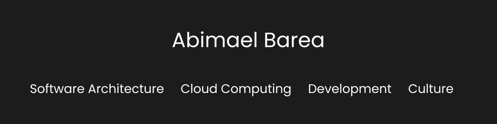

## What was the first programming language you learned, and when?

Basic, I was 12. 

## What programming languages have you learned and used during your career?

- Basic
- Ada
- C
- Bash
- Java
- C++
- Python
- Objective C
- Swift
- Kotlin
- Typescript
- Javascript

## Featured Blog Posts

| Topic | Post |
|---- | :----: |
| Software Architecture |[CSS, a vast and unknown universe](https://www.abimaelbarea.com/blog/css) |
| Cloud Computing | [Cloud, the real cost](https://www.abimaelbarea.com/blog/cloud-cost)  |
| Development | [Web Components: LWC, Stencil, and Lit by Numbers](https://medium.com/front-end-weekly/web-components-lwc-stencil-and-lit-by-numbers-b158efcf82f7) |
| Culture | [The risk of Silos within Tech Teams](https://www.abimaelbarea.com/blog/tech-silos) |

More on https://www.abimaelbarea.com/blog
